# Tour Extraction System - Inteligência Artificial para Extração de Dados de Catálogos Turísticos

---

## 👥 Informações do Grupo

### Nome do Grupo

- **Grupo 287**

### Integrantes do Grupo
- Bruno Leão
- Gleice Santos
- Jander Rocha
- Wagner Lemos
- Wilson
- Victor Souza

---

## 📋 Descrição do Tema do Projeto

### O Que Foi Desenvolvido

O **Tour Extraction System** é uma solução inteligente e automatizada que revoluciona a forma como informações de catálogos turísticos em formato PDF são extraídas, estruturadas e distribuídas. O sistema utiliza **Inteligência Artificial** (CrewAI com GPT-4o-mini), **processamento de linguagem natural**, **indexação semântica com FAISS** e **OCR integrado** para transformar documentos não-estruturados em dados padronizados e prontos para análise.

O sistema foi projetado para **resolver um problema crítico da indústria de turismo**: a impossibilidade de processar de forma automatizada e padronizada as informações contidas em tarifários, catálogos de agências e documentos similares. Enquanto empresas historicamente dependem de entrada manual de dados ou processamento técnico manual, o Tour Extraction System oferece uma abordagem totalmente **automatizada, escalável e inteligente**.

### Ganho de Valor para as Empresas

Para as empresas que adotarem esta solução, os benefícios são:

- **Extração Padronizada de Dados**: Independentemente do formato, idioma ou estrutura do documento PDF, o sistema extrai informações em um formato tabular padronizado e consistente (atualmente, o sistema está especialmente adequado para lidar com arquivos .pdf nos padrões Americano e Europeu)
- **Integração em Plataformas de Marketplace**: O sistema pode ser embedado nativamente em plataformas de viagens para automatizar o onboarding de agências parceiras
- **Pesquisa de Mercado Facilitada**: Analistas podem comparar preços, durações, cidades e características de tours entre múltiplos concorrentes em minutos, não semanas
- **Redução de Custos Operacionais**: Eliminação de trabalho manual, redução de erros humanos, agilidade em processos
- **Vantagem Competitiva**: Acesso rápido a inteligência de mercado para decisões estratégicas de pricing e posicionamento

---

## 🎯 Público Alvo

A solução foi desenvolvida para três segmentos principais:

### 1. **Empresas de Marketplace de Viagens**
Plataformas que agregam ofertas de múltiplas agências e prestadores. Para este público, o sistema oferece:
- Onboarding automatizado de parceiros
- Normalização de dados de diferentes fontes
- Redução de tempo para disponibilizar novas experiências na plataforma
- Possibilidade de embedar diretamente na sua infraestrutura

### 2. **Analistas de Mercado e Business Intelligence**
Profissionais que buscam entender o cenário competitivo de forma rápida e confiável:
- Comparação de preços entre competidores
- Análise de tendências de mercado
- Identificação de oportunidades de pricing
- Geração rápida de insights através de dados estruturados

### 3. **Donos de Experiências Turísticas**
Agências locais, operadores de tours e experiências que precisam organizar e tabular seus próprios itinerários:
- Estruturação organizada de suas experiências
- Facilitação do envio de dados para plataformas
- Análise de sua própria linha de produtos

---

## 💡 Justificativa do Tema do Projeto

### Por Que Isto É Importante

Imagine este cenário real: Uma startup de marketplace de viagens recebe **100 solicitações mensais** de agências parceiras querendo cadastrar suas experiências. Cada agência envia um catálogo em PDF com suas ofertas. Hoje, um analista deve abrir cada PDF, ler manualmente, extrair informações em planilhas, validar dados, e enviar para o time técnico fazer o cadastro. **Esse processo leva, em média, 30 minutos por agência. São 50 horas de trabalho mensal**.

Agora imagine: A mesma empresa implementa o Tour Extraction System. Uma agência envia o PDF. Em menos de 15 minutos, o sistema processa o documento inteiro, extrai **automaticamente** títulos, localizações, preços, durações, descrições, observações e todas as informações estruturadas. Os dados já saem em Excel, prontos para integração. **Os 50 horas viram 25 horas de validação apenas. Uma redução de 50% do tempo operacional.** - *Que pode ser esclada se houver hardware adequaado disponível, aumentando a redução do tempo de processamento*

Mas há mais: Os analistas de mercado que competem com essa startup podem agora fazer **análise competitiva em dias**, não meses. Eles processam PDFs de 50 concorrentes simultaneamente, extraem dados estruturados, e têm um retrato completo do mercado. Decisões estratégicas que levavam semanas agora podem levar horas.

### O Que Agrega de Valor

#### Para Marketplaces de Viagens
O Tour Extraction System transforma **tempo de integração em velocidade de crescimento**. Quanto mais rápido uma plataforma consegue onboard novos parceiros, maior sua oferta, maior sua competitividade. Este sistema **multiplica a capacidade operacional** sem multiplicar a equipe.

#### Para Analistas de Mercado
Fornece **acesso democratizado a inteligência competitiva**. Informações que antes eram monopólio de empresas com times grandes de análise agora estão ao alcance de equipes menores. **Iguala o jogo de mercado**.

#### Para Operadores de Turismo
Oferece **profissionalização e escalabilidade**. Uma agência pequena consegue estruturar seus dados da mesma forma que uma grande corporation, facilitando parcerias e expansão.

### Por fim: A Transformação Digital do Turismo

O turismo é a **segunda maior economia** de vários países. Mas enquanto tecnologia transformou varejo, finanças e educação, o turismo ainda depende de **processos manuais, PDFs e planilhas**. Agências modernas convivem com sistemas antigos, dados desorganizados e impossibilidade de escala.

O Tour Extraction System é o **elo perdido** dessa transformação. É IA que não busca substituir humanos, mas **potencializar decisões humanas**. Permite que um analista foque em estratégia, não em digitação. Permite que uma startup de viagens cresça 10x sem inchar sua equipe operacional. Permite que agências pequenas compitam no mesmo nível que grandes players.

**É democratização de tecnologia. É velocidade de inovação. É transformação digital real.**

---

## 🔧 Detalhamento do Que Foi Desenvolvido

### Visão Geral da Arquitetura

O Tour Extraction System é organizado em **4 etapas de processamento sequencial**, cada uma com responsabilidades específicas, que se comunicam através de uma arquitetura modular e escalável.

```
INPUT (PDF)   →   [ETAPA 1]    → [ETAPA 2]    → [ETAPA 3]    → [ETAPA 4]    → OUTPUTS (XLSX)
                  Chunking       Indexação      Extração       Exportação   
                                 Semântica      com IA         & Refino     
```

---

### **ETAPA 1: Chunking de PDF** 📄
**Arquivo:** `src/processors/pdf_chunker.py`

#### Responsabilidade
Converter um PDF de múltiplas páginas em **chunks de texto estruturado**, preparando o documento para as etapas seguintes.

#### Como Funciona
1. **Inicialização**: Configura o pipeline Docling com opções de OCR (Optical Character Recognition)
2. **Divisão**: Separa o PDF página por página usando PyPDF2
3. **Conversão**: Para cada página:
   - Cria um PDF temporário contendo apenas aquela página
   - Aplica OCR se habilitado (reconhecimento óptico para PDFs digitalizados)
   - Converte a página para Markdown estruturado usando Docling
   - Salva como arquivo `.md` numerado (`page_001.md`, `page_002.md`, etc.)
4. **Limpeza**: Remove arquivos temporários para liberar memória

#### Por Que É Importante
- **OCR Integrado**: Permite processar PDFs digitalizados (imagens), não apenas PDFs com texto nativo
- **Estrutura Markdown**: Preserva hierarquias do documento (títulos, listas, tabelas)
- **Escalabilidade**: Processa página por página, permitindo PDFs de centenas de páginas
- **Preparação**: Transforma um formato não-estruturado (PDF visual) em texto estruturado (Markdown)

#### Saídas Geradas
- `output/chunks/page_001.md`
- `output/chunks/page_002.md`
- ... (uma por página do documento)

---

### **ETAPA 2: Indexação Semântica** 🔍
**Arquivo:** `src/processors/semantic_indexer.py`

#### Responsabilidade
Criar um **índice vetorial inteligente** que permite buscar informações semanticamente relacionadas, independentemente de palavras-chave exatas.

#### Como Funciona
1. **Carregamento**: Lê todos os chunks markdown gerados na Etapa 1
2. **Embeddings**: Usa o modelo `sentence-transformers/all-MiniLM-L6-v2` para gerar vetores (representações numéricas do significado) de cada chunk
3. **Indexação FAISS**: Cria um índice FAISS (Facebook AI Similarity Search) otimizado para busca por similaridade de cosseno
4. **Persistência**: Salva:
   - Índice FAISS (`chunks.faiss`)
   - Embeddings em NumPy (`embeddings.npy`)
   - Mapeamento de arquivos (`files.json`)

#### Funcionalidade de Busca
```python
# Exemplo: Buscar chunks similares a um texto
similar_chunks = indexer.search_similar_chunks(
    "tours com duração de 4 horas em Paris",
    top_k=3
)
```

#### Por Que É Importante
- **Contexto Semântico**: Permite que a Etapa 3 (IA) compreenda melhor o contexto quando extrai informações
- **Busca Inteligente**: Mesmo que um documento diga "3-4 horas" e o prompt procure "duração de 4 horas", o sistema consegue correlacionar
- **Redução de Erros**: IA recebe contexto relevante, reduzindo alucinações e erros de extração
- **Escalabilidade**: FAISS é otimizado para buscas rápidas mesmo em indices grandes

#### Saídas Geradas
- `output/index/chunks.faiss` (Índice vetorial)
- `output/index/embeddings.npy` (Vetores numéricos)
- `output/index/files.json` (Mapeamento de chunks)

---

### **ETAPA 3: Extração de Tours com IA** 🤖
**Arquivo:** `src/processors/tour_extractor.py`

#### Responsabilidade
Usar **Inteligência Artificial (CrewAI com GPT-4o-mini)** para extrair informações estruturadas de tours a partir dos chunks textuais.

#### Como Funciona

**A. Configuração de Agente IA**
```python
agent = Agent(
    role="Extrator Universal Multi-Idioma de Tours",
    goal="Extrair informações completas de tours/tarifários",
    backstory="Especialista em catálogos turísticos globais..."
)
```

**B. Processamento Paralelo**
- Divide chunks entre múltiplos workers (padrão: 5)
- Aplica rate limiting para não sobrecarregar API OpenAI (50 req/min)
- Para cada chunk, executa:
  1. **Busca Semântica**: Usa indexador para encontrar chunks similares (contexto expandido)
  2. **Prompt Estruturado**: Envia chunk + contexto para IA com instruções específicas
  3. **Extração JSON**: IA retorna dados estruturados em JSON
  4. **Validação**: Valida estrutura JSON antes de persistir

**C. Multi-Idioma e Multi-Formato**
- Detecta idioma automaticamente
- Suporta formatos europeus (vírgula como separador decimal)
- Suporta formatos latino-americanos
- Processa português, inglês, espanhol e francês

**D. Schema de Extração (20+ Campos)**
```json
{
  "id": "1",
  "city": "Paris",
  "title": "Sightseeing tour with english speaking driver",
  "location": {
    "main": "Paris",
    "region": "Ile-de-France",
    "zone": null
  },
  "duration": {
    "quantity": 4,
    "unit": "hours"
  },
  "description": "Complete description...",
  "pricing_type": "per_vehicle",
  "options": [{
    "name_option": "Car/Van with driver",
    "details": [{
      "capacity": "01-03 pax",
      "vehicle_options": "car",
      "price": {
        "quantity": 625,
        "currency": "EUR"
      }
    }]
  }],
  "schedule": {...},
  "meeting_point": "Hotel lobby",
  "includes": ["Guide", "Transport"],
  "excludes": ["Meals"],
  "language_options": ["english", "french"],
  "operation": {...},
  "min_booking": 2,
  "observations": "Additional notes...",
  "source_chunks": ["page_001.md"]
}
```

#### Por Que É Importante
- **IA Atuante**: Não é um simples parser regex, é IA que compreende contexto
- **Parallelização**: Processa múltiplos chunks simultaneamente, acelerando extração
- **Rate Limiting**: Gerencia custos e evita erros de API
- **Contexto Expandido**: Busca semântica fornece mais informação à IA, melhorando precisão
- **Estrutura Robusta**: JSON estruturado facilita integração com sistemas downstream

#### Saídas Geradas
- JSON estruturado com todos os tours extraídos
- Metadados de extração (chunks fonte, confiança, etc.)

---

### **ETAPA 4: Exportação e Refinamento** 📊
**Arquivos:** `src/processors/result_exporter.py` e `src/processors/result_refiner.py`

#### Etapa 4A: Exportação Bruta (`result_exporter.py`)

**Responsabilidade**: Converter JSON estruturado em múltiplos formatos de saída.

**Processo JSON**
- Salva JSON completo com toda a hierarquia original
- Preserva todas as opções, preços, detalhes
- Formato: `tours_extracted.json`

**Processo Excel Bruto**
- **Normalização**: Expande estruturas aninhadas (opções, preços, etc.)
- **Multi-formato**: 
  - Formato europeu: Uma linha por opção de veículo
  - Formato latino: Uma linha por matriz de preços
- **Colunas (30+)**: ID, City, Title, Location Main/Region/Zone, Description, Duration, Schedule, Pricing Type, Option Name, Capacity, Vehicle Options, Price, Currency, e mais
- **Formato**: `tours_extracted.xlsx`

#### Etapa 4B: Refinamento Final (`result_refiner.py`)

**Responsabilidade**: Criar versão limpa, deduplica e otimizada para o usuário final.

**Processo de Refinamento**

1. **Seleção de Campos Essenciais**: Filtra apenas 9 campos principais
2. **Otimização de Preços**: 
   - Varre **todas as opções disponíveis**
   - Seleciona o **menor preço encontrado** (estratégia inteligente para comparações)
   - Mantém moeda correspondente
   - Nunca perde informação: se havia preço, sempre encontra
3. **Deduplicação**: Remove linhas duplicadas por Title + Location Main
4. **Formatação**: Renomeia colunas para legibilidade com espaços

**Campos do Excel Refinado (9 Essenciais)**
- Title
- Location Main  
- Description
- Duration
- Duration Unit
- Min Adults
- Observations  
- Price (menor preço de todas as opções)
- Currency

**Formato**: `tours_extracted_refined.xlsx`

#### Por Que Essas Saídas

| Formato | Público-Alvo | Uso |
|---------|-------------|-----|
| **JSON** | Desenvolvedores, Integrações | APIs, sistemas backend, processamento automático |
| **Excel Bruto** | Analistas, Power Users | Análise detalhada, pesquisa de mercado, comparações específicas |
| **Excel Refinado** | Usuários Finais, Dashboards | Visualização limpa, relatórios, integração em BI |

---

## 🎨 Interface de Usuário - Streamlit

### Responsabilidade
Fornecer interface web intuitiva e sem necessidade de conhecimento técnico para processar PDFs.

### Funcionalidades

**1. Upload Simples**
- Drag-and-drop de PDFs
- Validação automática de formato
- Exibição de tamanho do arquivo

**2. Processamento Transparente**
- Barra de progresso visual
- Logs em tempo real de cada etapa
- Feedback claro sobre andamento

**3. Visualização de Resultados**
- **Primeiras 100 linhas** do Excel completo (preview)
- **Estatísticas**: Total de tours e cidades extraídas
- Tabela interativa com scroll

**4. Design Clean**
- Sidebar minimalista com apenas configurações essenciais
- Layout responsivo (wide)
- Instruções acessíveis para novos usuários

---

## 🏗️ Arquitetura Técnica Completa

### Componentes de Apoio

#### **Gerenciamento de Configuração** (`config.py`)
- Centraliza todas as configurações do sistema
- Carrega parâmetros de `settings.yaml`
- Valida configurações obrigatórias
- Oferece interface estruturada com `SystemConfig`

#### **Sistema de Logging** (`logger.py`)
- Logs estruturados com níveis (DEBUG, INFO, WARNING, ERROR)
- Saída no console com timestamps
- Rastreamento de progresso por etapa
- Integração com Streamlit para exibição em tempo real

#### **Rate Limiting** (`rate_limiter.py`)
- Controla requisições para OpenAI API
- Implementa sliding window (janela deslizante)
- Previne erros por "quota exceeded"
- Permite configuração de limite por minuto

#### **Pipeline Principal** (`pipeline.py`)
- Orquestra execução sequencial das 4 etapas
- Gerencia dependências entre componentes
- Logs de progresso e estatísticas finais
- Tratamento robusto de erros por etapa

#### **Configurações** (`settings.yaml`)
```yaml
# Controla todos os parâmetros do sistema
directories:
  uploads: "uploads"
  chunks: "output/chunks"
  index: "output/index"
  results: "output/results"

pdf_processing:
  enable_ocr: true
  pages_per_chunk: 1

extraction:
  llm_model: "openai/gpt-4o-mini"
  temperature: 0.0
  max_workers: 5
  rate_limit_per_minute: 50
```

---

## 📈 Fluxograma do Sistema



> **Descrição:**
> O fluxo inicia com a entrada de um catálogo turístico em PDF por meio da interface Streamlit, passando por um pipeline de processamento que realiza o chunking do PDF, indexação semântica com FAISS, extração de informações de tours via agentes CrewAI em múltiplos idiomas, e estruturação dos dados em JSON. Os resultados são exportados e refinados em duas etapas, gerando tanto um Excel bruto quanto um refinado, e apresentados em uma interface web para visualização e download pelo usuário, com suporte a debug interno para testes e validações.

---

## 📱 Fluxo de Uso - Perspectiva do Usuário



> **Descrição:**
> O fluxo começa com a entrada do PDF do catálogo turístico, que é processado por um pipeline central (incluindo Streamlit), passando por etapas integradas de chunking e indexação semântica, seguidas por extração automatizada de tours via agentes CrewAI, resultando em dados refinados e estruturados. Esses dados são exportados e otimizados em Excel bruto e refinado, disponibilizados em uma interface web para visualização e download pelo usuário, com suporte adicional a testes e validação interna por debug dedicado.

---

## 🔄 Como as Peças Se Encaixam

### Exemplo Prático: Processando um PDF de 5 Páginas

**Entrada**: PDF de catálogo turístico de agência em Paris com 5 páginas

**Etapa 1 - Chunking**:
```
page_001.pdf → Docling → page_001.md (com estrutura markdown)
page_002.pdf → Docling → page_002.md
page_003.pdf → Docling → page_003.md
page_004.pdf → Docling → page_004.md
page_005.pdf → Docling → page_005.md
```

**Etapa 2 - Indexação**:
```
[page_001.md, page_002.md, page_003.md, page_004.md, page_005.md]
         ↓ (sentence-transformers)
[vec1, vec2, vec3, vec4, vec5] → FAISS Index
         ↓
Agora é possível buscar: "tours em Paris" e encontrar chunks relevantes
```

**Etapa 3 - Extração**:
```
Worker 1: page_001.md + [vec2, vec3] (chunks similares) → CrewAI → JSON Tours 1-3
Worker 2: page_002.md + [vec1, vec4] (chunks similares) → CrewAI → JSON Tours 4-7
Worker 3: page_003.md + [vec5] (chunks similares)       → CrewAI → JSON Tours 8-10
Worker 4: page_004.md + [vec1, vec2] (chunks similares) → CrewAI → JSON Tours 11-14
Worker 5: page_005.md + [vec3, vec4] (chunks similares) → CrewAI → JSON Tours 15-18

Total: 18 tours extraídos em ~2 minutos (parallelizado)
```

**Etapa 4A - Exportação Bruta**:
```
JSON (18 tours, hierarquia completa)
     ↓ (Normalização)
Excel Bruto: 45 linhas × 30 colunas
(múltiplas linhas por tour devido a diferentes opções/preços)
```

**Etapa 4B - Refinamento**:
```
Excel Bruto (45 linhas)
     ↓ (Menor preço + Deduplicação)
Excel Refinado: 18 linhas × 9 colunas
(uma linha por tour, com menor preço)
```

**Etapa 5 - Interface Streamlit**:
```
Excel Refinado (18 linhas)
     ↓ (Preview + Stats)
Tabela: 18 linhas × 9 colunas
Stats: "18 tours | 1 cidade"
     ↓ (Download)
Usuário baixa: tours_extracted.xlsx (completo, 45 linhas)
```

---

## 💻 Stack Tecnológico

| Componente | Tecnologia | Justificativa |
|-----------|-----------|---------------|
| **PDF Processing** | Docling | OCR avançado, suporte multi-formato |
| **Text Splitting** | PyPDF2 | Divisão confiável página por página |
| **Embeddings** | Sentence-Transformers | Modelos leves, rápidos, acurados |
| **Indexação Vetorial** | FAISS | Busca semântica otimizada, escalável |
| **IA / LLM** | CrewAI + OpenAI | Agentes autônomos, multi-objetivo |
| **Data Processing** | Pandas | Manipulação de dados robusta |
| **Excel Export** | Openpyxl | Formatação avançada, compatibilidade |
| **Web Interface** | Streamlit | Desenvolvimento rápido, sem JS |
| **Configuration** | YAML | Fácil customização, sem código |
| **Logging** | Python Logging | Rastreamento de execução |

---

## 📊 Métricas de Performance

### Tempo de Processamento

| Operação | Tempo Típico |
|----------|-------------|
| Chunking (1 página) | 10-120s (com OCR) |
| Indexação (13 páginas) | 5-20s |
| Extração (13 chunks, 5 workers) | 2-8 minutos |
| Exportação | 2-5s |
| Refinamento | 1-2s |
| **Total (13 páginas, ~45 tours)** | **~3-10 minutos** |

---

## 🔐 Segurança e Conformidade

### Considerações Implementadas

- **API Keys**: Armazenadas em `.env`, nunca no código
- **Processamento Temporário**: PDFs são processados em temp files e imediatamente deletados
- **Sem Armazenamento de Dados**: Apenas dados finais são salvos em Excel
- **Logs Estruturados**: Rastreamento completo sem exposição de dados sensíveis
- **Session State**: Dados do usuário isolados por sessão Streamlit

---

## 📦 Dependências Principais

```
crewai==0.86.0          # Framework de agentes IA
openai==1.55.3          # API OpenAI
docling==2.12.1         # Conversão PDF
sentence-transformers   # Embeddings
faiss-cpu==1.9.0        # Indexação vetorial
pandas==2.2.3           # Manipulação de dados
streamlit==1.40.1       # Interface web
```

---

## 🌐 Repositório do Projeto

### Estrutura do Repositório

```
tour-extraction-system/
├── src/
│   ├── core/                    # Componentes centrais
│   │   ├── config.py           # Gerenciamento de configurações
│   │   └── logger.py           # Sistema de logging
│   ├── processors/             # Processadores principais
│   │   ├── pdf_chunker.py      # Conversão PDF → Markdown
│   │   ├── semantic_indexer.py # Indexação FAISS
│   │   ├── tour_extractor.py   # Extração com IA
│   │   ├── result_exporter.py  # Exportação JSON/Excel
│   │   └── result_refiner.py   # Refinamento final
│   ├── utils/                  # Utilitários
│   │   └── rate_limiter.py     # Controle de requisições
│   ├── schemas.py              # Esquemas de dados
│   └── pipeline.py             # Orquestrador principal
├── config/
│   └── settings.yaml           # Configurações do sistema
├── app.py                      # Interface Streamlit
├── main.py                     # CLI (Ponto de entrada)
├── .venv                       # Ambiente Virtual
```

### Como Usar o Repositório

```bash
# 1. Clone o repositório
git clone https://github.com/I2A2_Agentes_Inteligentes/tour-extraction-system.git
cd tour-extraction-system

# 2. Instale dependências
pip install -r requirements.txt

# 3. Configure ambiente
cp .env.example .env
# Edite .env com sua OPENAI_API_KEY

# 4. Execute
streamlit run app.py
```

---

## 📈 Roadmap Futuro

### Curto Prazo (1-2 meses)
- [ ] Suporte a múltiplos formatos (Word, HTML, imagens)
- [ ] Cache inteligente de embeddings
- [ ] Dashboard com estatísticas avançadas do processamento
- [ ] Possibilidade de utilização de outras LLMs

### Médio Prazo (3-6 meses)
- [ ] API REST para integração
- [ ] Modelos de IA locais (Ollama)
- [ ] Processamento batch de múltiplos PDFs

### Longo Prazo (6-12 meses)
- [ ] Marketplace de integrações
- [ ] Relatórios automáticos de análise

---

**Desenvolvido pelo Grupo 287 - I2A2 Agentes Inteligentes**

Data de Conclusão: 30 de Outubro de 2025
